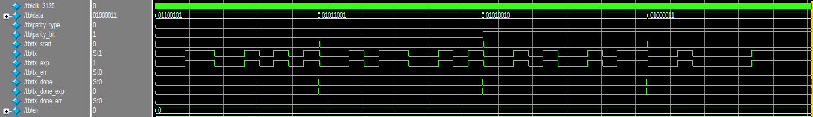
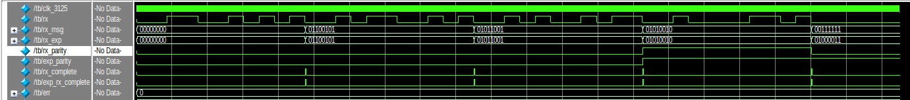

# UART Transmitter with Parity (Verilog)

## Description
This project implements a **UART (Universal Asynchronous Receiver Transmitter) Transmitter using Verilog HDL**. The transmitter sends 8-bit parallel data serially according to the UART communication protocol.  

The design supports **configurable parity (even or odd)** and transmits a complete UART frame consisting of:

- Start bit  
- 8 data bits  
- Parity bit  
- Stop bit  

A **Finite State Machine (FSM)** is used to control the transmission process and ensure correct timing based on the given baud rate.

---

## UART Parameters

| Parameter | Value |
|----------|------|
| Baud Rate | 115200 |
| Data Bits | 8 |
| Parity Bit | 1 |
| Stop Bit | 1 |
| Clock Frequency | 3.125 MHz |

---

## Module Interface

| Signal | Type | Description |
|------|------|-------------|
| `clk_3125` | Input | 3.125 MHz clock signal used for UART timing |
| `parity_type` | Input | Selects parity type (0 → Even parity, 1 → Odd parity) |
| `tx_start` | Input | Signal to start UART transmission |
| `data[7:0]` | Input | 8-bit input data to be transmitted (MSB → LSB) |
| `tx` | Output | Serial output line for UART transmission |
| `tx_done` | Output | Indicates successful transmission of the complete UART frame |

---

## UART Frame Format

Each transmitted UART packet follows the structure:

- **Start Bit:** Indicates the beginning of transmission (logic LOW).
- **Data Bits:** 8-bit data sent serially (MSB first).
- **Parity Bit:** Used for error detection.
- **Stop Bit:** Indicates the end of the frame (logic HIGH).

---

## Working Principle

1. The transmission begins when the **`tx_start` signal becomes HIGH**.
2. The transmitter first sends a **Start Bit (0)**.
3. The **8-bit input data** is then transmitted serially.
4. A **parity bit** is generated based on the selected parity type:
   - Even parity → total number of 1s should be even
   - Odd parity → total number of 1s should be odd
5. After sending the parity bit, the transmitter sends a **Stop Bit (1)**.
6. Once the full UART frame is transmitted, the **`tx_done` signal is asserted for one clock cycle**.
7. The transmitter then returns to the **idle state** and waits for the next `tx_start`.

---

## Design Approach

The UART transmitter is implemented using a **Finite State Machine (FSM)** with the following states:

- **IDLE** – Waits for transmission request.
- **START** – Sends the start bit.
- **DATA** – Transmits the 8-bit data serially.
- **PARITY** – Sends the calculated parity bit.
- **STOP** – Sends the stop bit.
- **DONE** – Indicates completion of transmission.

---

## Simulation
during tx

during rx

---

## Applications

- Serial communication between devices  
- Microcontroller to FPGA communication  
- Debug communication interfaces  
- Embedded system data transfer
